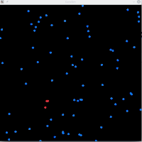

# CoroSim

A simple infection simulator, written in Swift using Raylib to run the simulation.
The results can be viewed with a Python Jupyter Notebook ("use the tools you know, right?").

This was mainly a programming exercise to learn the Swift programming language and is not meant to be of any scientific value.
But we had fun trying out different parameters and comparing the results in the family.

Because of the experimental nature of the project, the parameters of the simulation can only be adjusted in the source code itself.
Please have a look at the comments of the `Parameters` struct for the available parameters
and their function.

## Requirements

* [Swift](https://swift.org/) Compiler toolchain
    * The program uses GLibc and therefore probably only runs on Linux (only tested there)
* [Raylib](https://github.com/raysan5/raylib)  - "A simple and easy-to-use library to enjoy videogames programming"
* Jupyter Notebook with (install via `conda`):
    * Python >= 3.7
    * Pandas
    * Matplotlib

## How to Run

Clone the repo, adjust the parameters in `Sources/CoroSim/main.swift` and run the simulation with
`swift run`.

A Raylib window will open and run the simulation:

