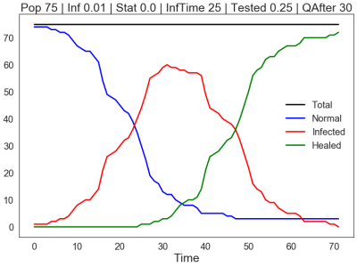
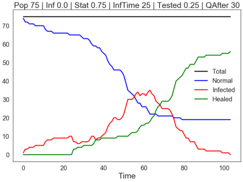

# CoroSim

A simple infection simulator, written in Swift using Raylib to run the simulation.
The results can be viewed with a Python Jupyter Notebook ("use the tools you know, right?").

This was mainly a programming exercise to learn the Swift programming language and is not meant to be of any scientific value.
But we had fun trying out different parameters and comparing the results in the family.

Because of the experimental nature of the project, the parameters of the simulation can only be adjusted in the source code itself.
Please have a look at the comments of the `Parameters` struct for the available parameters
and their function.

## Requirements

* [Swift](https://swift.org/) Compiler toolchain
    * The program uses GLibc and therefore probably only runs on Linux (only tested there)
* [Raylib](https://github.com/raysan5/raylib)  - "A simple and easy-to-use library to enjoy videogames programming"
* Jupyter Notebook with (install via `conda`):
    * Python >= 3.7
    * Pandas
    * Matplotlib

## How to Run

Clone the repo, adjust the parameters in `Sources/CoroSim/main.swift` and run the simulation with
`swift run`.

In addition to the population size and the infection rate at the start, the following parameters can be set:
fraction of people staying at home, duration of the infection, fraction of people being tested, qurantaine after X days. 

A Raylib window will open and run the simulation:

Blue is a normal person, red is infected, green is healed. Violet means in quarantaine. A quarantained person can not infect others. The simulation does not include a death rate.

The simulation ends when there are no more infected or quarantained people.

Then the Jupyter Notebook `corosim` can be opened and run, it will automatically read the generated data and display the result.
For example, this is how a simulation with a population of 75 and on restriction on mobility turns out:

Here is the same example when 75% of the population "Stay at Home", the infected curve is much flatter:

